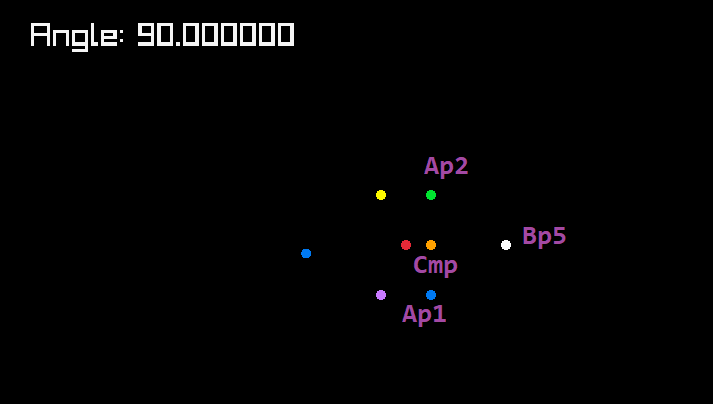

# Displacement And Rotation Points With Random Angle Bounds

A simple toy project that shows random bounded displacement of points rotating.

Only external library used was raylib despite what the ugly makefile shows.

